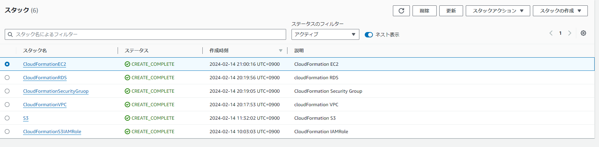
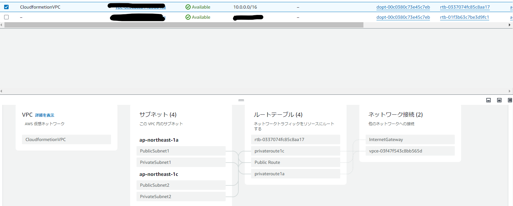
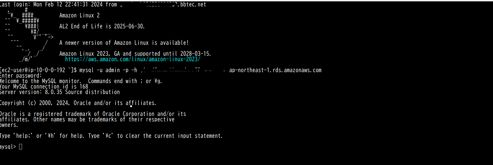
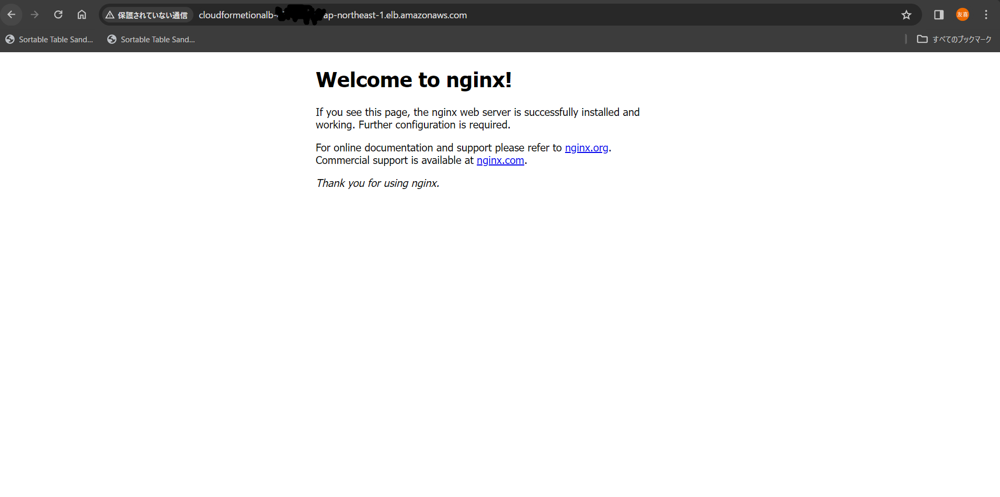
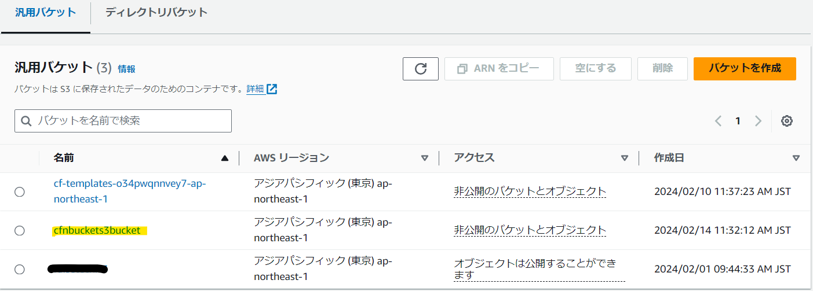
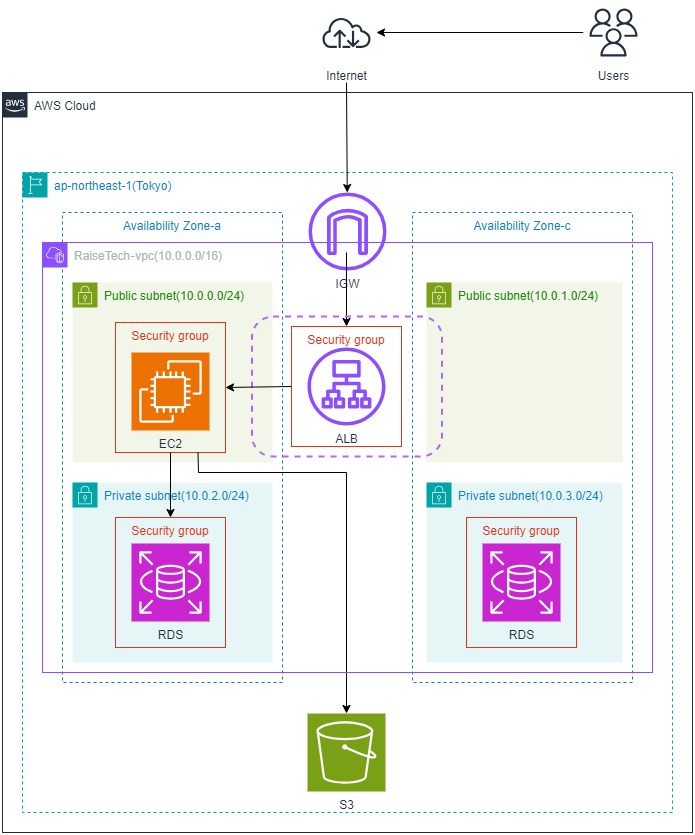

# 第10回講義  
## 講義内容  
* インフラ自動化  
* 自動化のメリット  
* 全自動と半自動  
* 自動化の範囲  
* Cloudformation  
* CloudFormationテンプレートの解説  
## 課題内容  
* CloudFormationを利用して現在まで作った環境をコード化する  

 | Stacks | リソース | Export情報 |
 | --- | --- | --- |
 | CloudFormationVPC | VPC | VPC-ID |
 | | PublicSubnet1 | PublicSubnet1-ID |
 | | PublicSubnet2 | PublicSubnet2-ID |
 | | PrivateSubnet1 | PrivateSubnet1-ID |
 | | PrivateSubnet2 | PrivateSubnet2-ID |
 | | IGW | |
 | | RouteTable |  |
 | | Route | |
 | | VPCENDpoint | MyVPCENDpoint‐ID |
 | CloudFormationSecurityGroup | EC2securityGroup | EC2securityGroup-ID |
 | | RDSsecurityGroup | RDSsecurityGroup-ID |
 | | ALBsecurityGroup | ALBsecurityGroup-ID |
 | CloudFormationIAMRole | IAMRole | S3AccessInstanceProfile-ID |
 | | Instanceprofile | |
 | CloudFormationEC2 | EC2Instance | MyEC2-ID |
 | | Keypair | |
 | CloudFormationRDS | DBinstance | |
 | | DBSubnetGroup | |
 | S3 | S3Bucket | MyS3bucket-ID |
 
* 作成済みのStacks  
   
* VPC構成  
   
* EC2Login＆MySQLLogin  
   
* ALB接続確認  
   
* S3作成済み  
   
## 構成図  
   