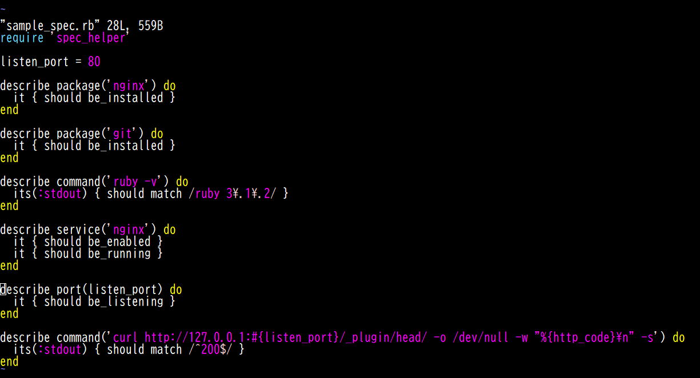
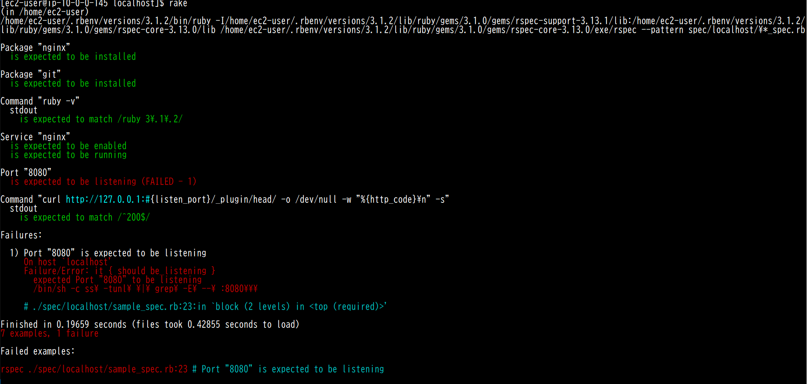
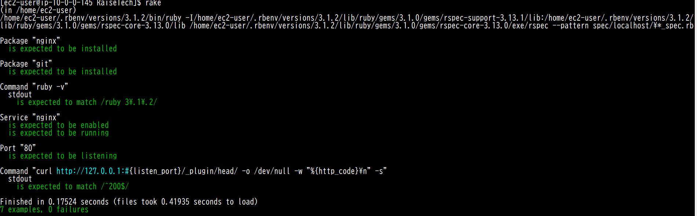

# 第11回講義  
## 講義内容  
* インフラのコード化を支援するツール  
* インフラのテスト  
* テスト駆動開発  
* ServerSpec  
* 良い質問と回答ピックアップ  
* TerraForm ハンズオン  
## 課題内容  
* sample‗server_spec_rbを成功させる
* カスタマイズ内容  
1. gitがインストールされているか？
2. rubyのversion確認  
3. nginxのスタートアップ登録の確認  
## sample_spec.rb詳細  
  
## port番号NG  8080
   
## port番号OK 80  
   