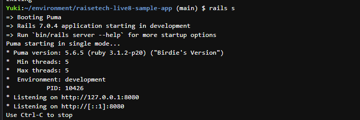
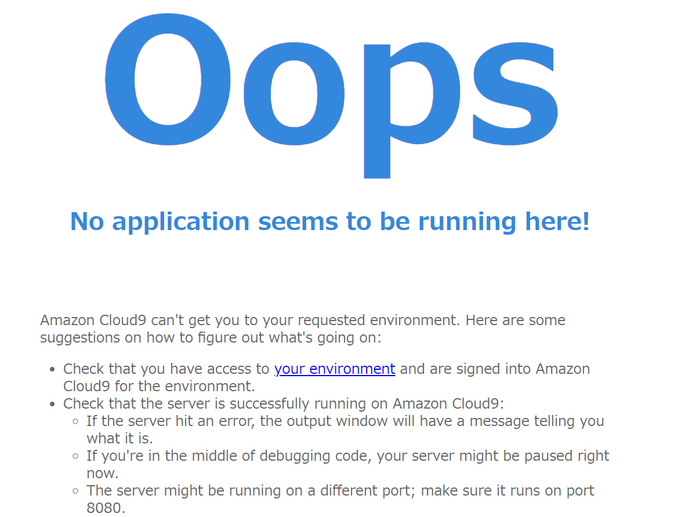
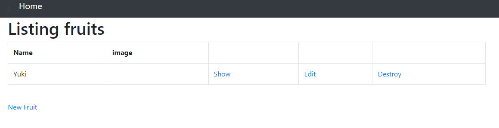

# 第三回課題
* **APサーバー**について  
  * APサーバーの名前　**PUMA**　version **5.6.5**  

  * APサーバーを終了させた場合はアクセスできずエラー表示　

  * APサーバーの再起動を行い再アクセス可能

* **DBサーバー**について
  * DBサーバーの名前 **MySQL** version **8.0.35**
  * DBサーバー停止命令後のエラー表示  
！[Mysql.png](IMG/Mysql.png)
* Rails構成管理ツール**bundler**

# 感想
- 一つ一つのコメントや単語の意味を調べながら、課題を実施したのでものすごく時間がかかった。  