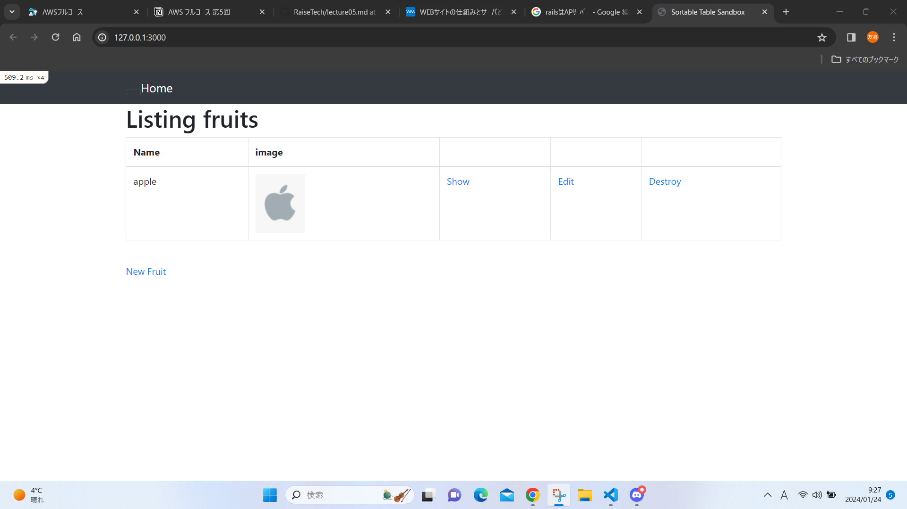
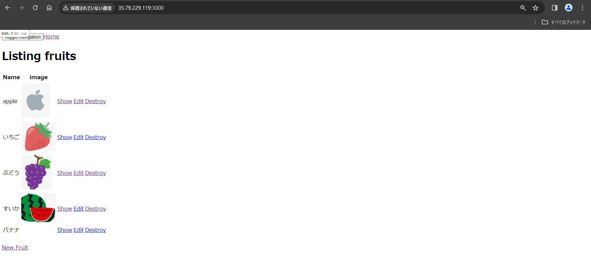
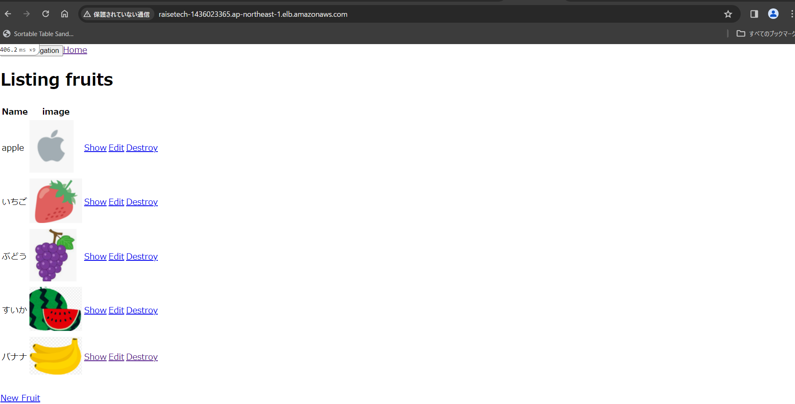
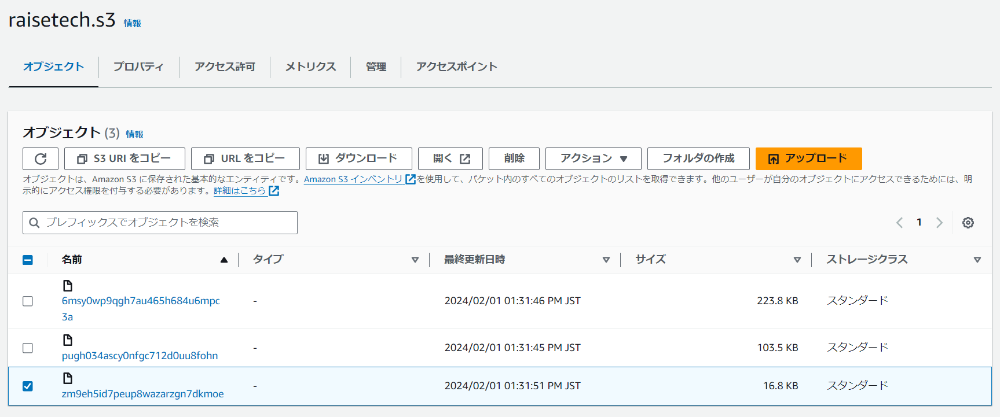
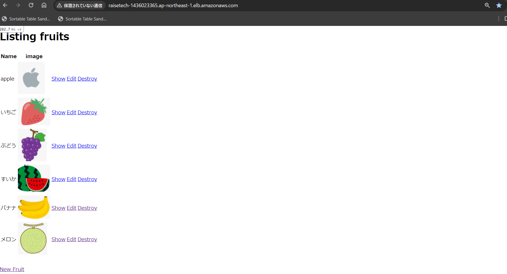
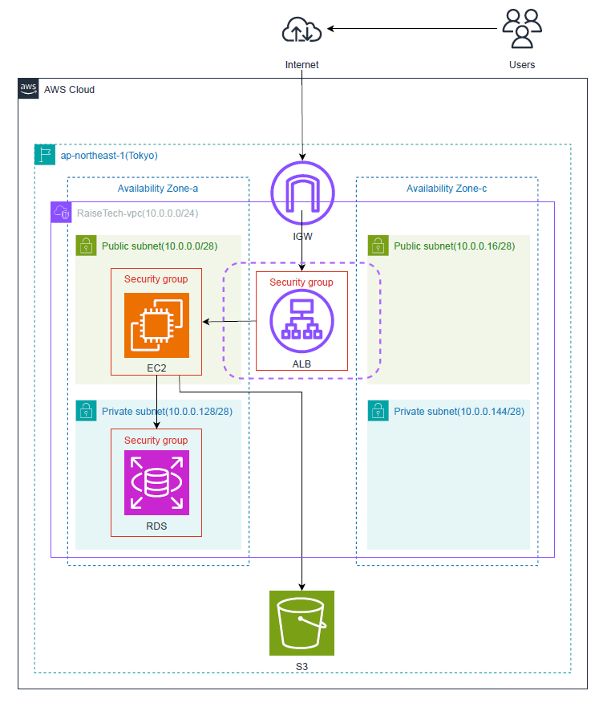

# 第５回  
## 講義内容  
* EC2にアプリケーションのデプロイ  
* **ELB**経由で**EC2**へ接続(冗長化・負荷分散)  
* アプリケーションのデータ保存先をS3に変更  
* **S3**の別の役割  
* インフラ構成図を書く  
# 課題内容  
## EC2上に組み込みサーバーを利用しデプロイをする。  
* 必要なソフトウェアのインストールをし環境構築実施  
  * ruby・node・yum・git・MySQL・Swapの設定  
    
## WEBサーバーとAPサーバーを分けた状態でデプロイをする  
* Nginx・unicornのインストール  
  * pathや挙動を確認しながらconfigの設定  
　   
## ELB(ALBの追加)  
* ターゲットグループの作成・セキュリティグループの作成・インスタンスのセキュリティグループ追加  
　  
* ALBでのデプロイ  
　  
## S3の作成
* IAMロールの追加・保存先をS3に変更 
　  
## S3を反映しアプリを起動しメロンを追加 
    
## 構成図の作成  
　
 
