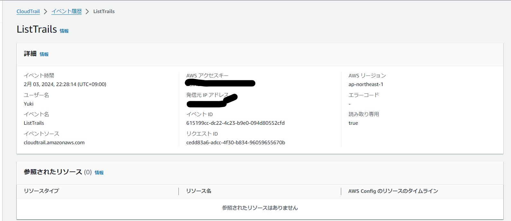
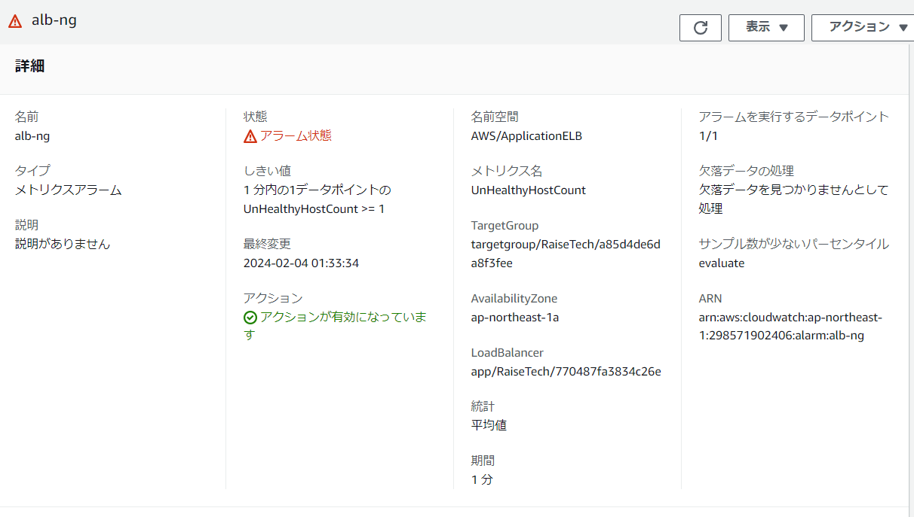
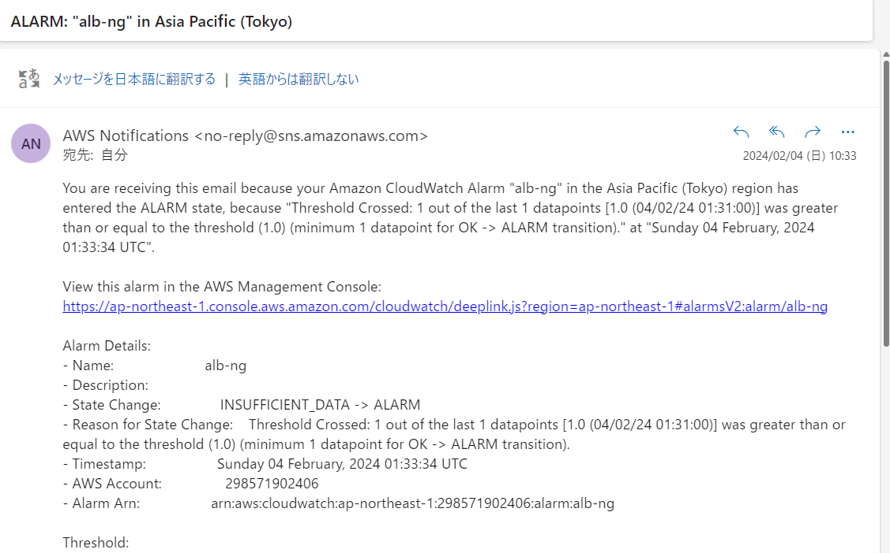
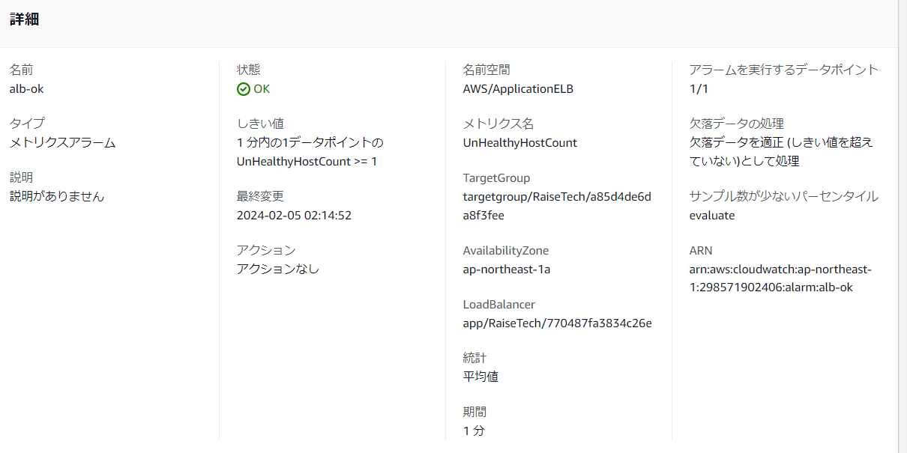
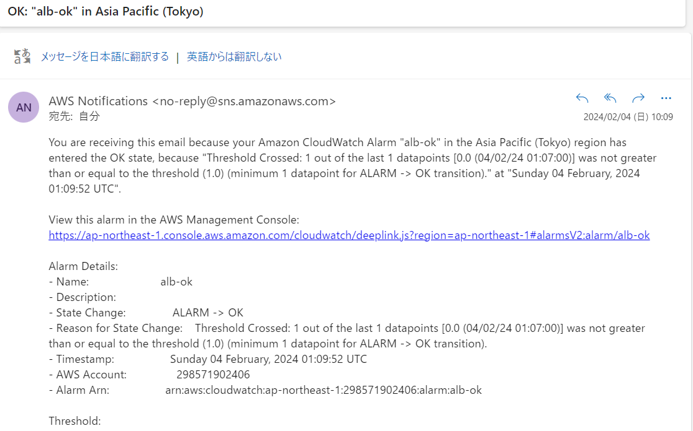
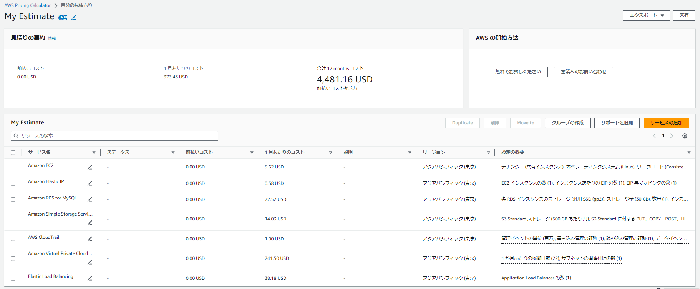
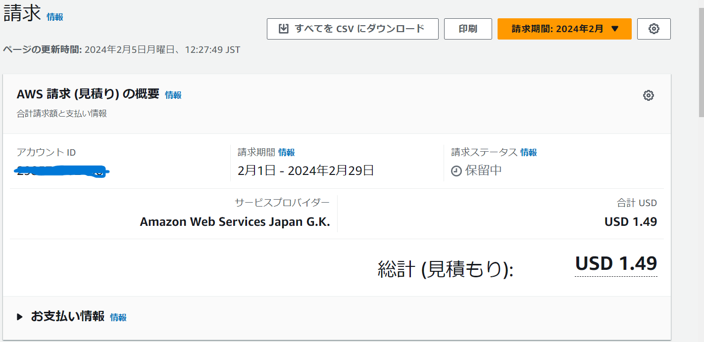
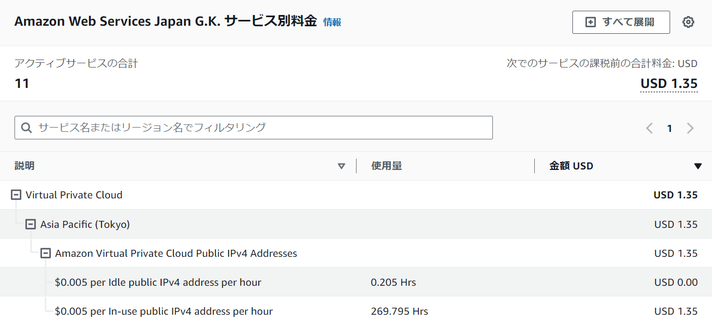

# 第6回  
## 講義内容  
* システムの安定稼働 
* AWSでの**証跡**、**ロギング**  
* **履歴がないこと** がどれだけ重大なのか理解する  
* AWSでの監視、通知  
* ALBでのアラーム通知デモンストレーション  
* AWSでのコスト管理  
# 課題  
##  AWS利用した日のイベントから情報を３つピックアップする  
    
* ログからの情報  
  * イベント名:listtrails  
  * 発信元IPアドレス  
  * イベントソース:cloudtrail.amazonaws.com  
  * イベントID:615199cc-dc22-4c23-b9e0-094d80552cfd  
## CloudWatchアラームを使用しALBアラームを設定し通知させる  
* ターゲットグループが**UnHealthy**の場合、**UnHealthyHostcount**にカウントが立ち欠落データとして処理しアラーム状態となる **タイムラグ有 **   
    
* **Amazon SNS**より通知  
　  
* ターゲットグループが**Healthy**の場合、**UnHealthyHostcount**にカウントが立たなくなり適正(しきい値を超えていない)と処理される  
　  
* **Amazon SNS**より通知  
　  
## AWS利用料の見積もり  
* 1日12時間月22日稼働した場合  
　  
## 現在の利用料  
* パブリックIPとEIPで無料枠に収まっていない  
　  
* サービス別  
　